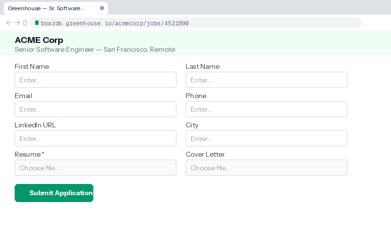

# ApplyPilot

**Smart Chrome extension that auto-fills job applications across 15+ ATS platforms. Works without API keys. AI cover letters optional.**

ApplyPilot detects form fields on job application pages, maps them to your profile, and fills everything in one click — name, email, phone, resume upload, cover letter, work authorization, salary expectations, and 30+ other field types. It works on Greenhouse, Lever, Ashby, Workday, LinkedIn Easy Apply, SmartRecruiters, and many more.

No backend. No tracking. No data collection. Everything stays in your browser.

<p align="center">
  
</p>

---

## Features

- **One-click form fill** — detects and fills 30+ field types including text inputs, dropdowns, radio buttons, file uploads, searchable/filterable selects, and custom ATS-specific fields
- **Resume + cover letter upload** — auto-uploads your PDF/DOCX resume and cover letter to file input fields
- **AI cover letters** (optional) — generates a tailored cover letter using Claude or GPT, referencing the specific job title, company, and your resume. Works without API keys too — uses a template-based fallback
- **15+ ATS platforms** — Greenhouse, Lever, Ashby, Workday, LinkedIn Easy Apply, SmartRecruiters, iCIMS, Jobvite, Taleo, BambooHR, Recruitee, Personio, Breezy, Indeed, Glassdoor, and more
- **Gmail job alerts** — detects job links in LinkedIn/Indeed alert emails and lets you save them to your job list
- **LinkedIn detection** — saves jobs from LinkedIn feed and job pages (read-only, never auto-applies)
- **Application tracker** — tracks all your applications with status (new, opened, applied, skipped, failed), company, title, source URL
- **Stats dashboard** — daily application counts, 7-day bar chart, application streak, source breakdown
- **Duplicate detection** — warns you before re-applying to the same company+role using fuzzy matching (Sorensen-Dice similarity)
- **Bulk operations** — multi-select and delete jobs, export data
- **EEO/demographic fields** — fills gender, race, veteran status, disability with your configured preferences or safe "Decline" defaults
- **Smart activation** — only activates on job sites, not on every page
- **Keyboard shortcut** — `Alt+Shift+A` to toggle the fill panel

## What it does NOT do

- Never auto-submits applications — you always click Submit yourself
- Never clicks Easy Apply or Submit buttons
- Never mass-applies or bulk-applies
- Never scrapes LinkedIn search results
- Never sends messages or connection requests
- Never phones home — zero analytics, zero telemetry

---

## Install

### From source (developer mode)

```bash
git clone https://github.com/ranjeet867/ApplyPilot.git
cd ApplyPilot
npm install
npm run build
```

1. Open Chrome and go to `chrome://extensions/`
2. Enable **Developer mode** (top-right toggle)
3. Click **Load unpacked** and select the `dist/` folder
4. Pin the ApplyPilot icon to your toolbar

### First-time setup

1. Click the ApplyPilot icon and go to **Settings**
2. Fill in your **Profile** — name, email, phone, city, salary range, notice period, work authorization
3. Upload your **Resume** (PDF or DOCX) — text is extracted locally for cover letter generation
4. Optionally upload a **Cover Letter** template
5. Optionally add an **API key** (Anthropic or OpenAI) for AI-generated cover letters

The extension works fully without API keys — it uses your profile data to fill forms and can generate basic cover letters from templates.

---

## Usage

### On any job application page

1. Navigate to a job application (Greenhouse, Lever, Ashby, LinkedIn Easy Apply, etc.)
2. The **ApplyPilot** panel appears at the bottom-right showing detected fields
3. Review the field mapping — it shows what will be filled and confidence scores
4. Click **Fill Form** to auto-fill all detected fields
5. Click **Generate & Upload CL** to create and upload a tailored cover letter
6. Review everything, then submit the application yourself

### Gmail job alerts

1. Open a job alert email from LinkedIn or Indeed in Gmail
2. ApplyPilot shows a floating panel with extracted job listings
3. Click **Save all jobs** to add them to your tracker

### Popup

- **Jobs tab** — view and manage tracked applications
- **Stats tab** — see your application dashboard (daily counts, streak, sources)
- **This Page tab** — quick view of detected fields on the current page

---

## Supported ATS Platforms

| Platform | Field Detection | Resume Upload | Cover Letter | Searchable Dropdowns |
|----------|:-:|:-:|:-:|:-:|
| Greenhouse | Yes | Yes | Yes | Yes |
| Lever | Yes | Yes | Yes | Yes |
| Ashby | Yes | Yes | Yes | Yes |
| LinkedIn Easy Apply | Yes | Yes | Yes | N/A |
| Workday | Yes | Yes | Yes | Yes |
| SmartRecruiters | Yes | Yes | Yes | Yes |
| iCIMS | Yes | Yes | Yes | — |
| Jobvite | Yes | Yes | Yes | — |
| Taleo | Yes | Yes | Yes | — |
| BambooHR | Yes | Yes | Yes | — |
| Recruitee | Yes | Yes | Yes | — |
| Personio | Yes | Yes | Yes | — |
| Breezy HR | Yes | Yes | Yes | — |
| Indeed | Yes | Yes | Yes | — |
| Glassdoor | Yes | Yes | Yes | — |
| Generic forms | Yes | Yes | Yes | — |

---

## Architecture

```
src/
├── background/index.ts      — MV3 service worker (message router, API calls, badge)
├── content/
│   ├── gmail.ts             — Gmail job alert extraction + floating panel
│   ├── linkedin.ts          — LinkedIn job detection (read-only)
│   └── jobPage.ts           — Field detection engine + Shadow DOM fill panel
├── popup/                   — React popup UI (job list, stats, settings link)
├── options/                 — React settings page (profile, resume, API keys)
└── shared/
    ├── storage.ts           — chrome.storage.local wrappers + fuzzy matching
    ├── db.ts                — IndexedDB for resume/cover letter binary storage
    ├── api.ts               — Anthropic + OpenAI API integration
    └── utils.ts             — Field matching, URL normalization, stats calculation
```

### Field Detection

The field detection engine (`jobPage.ts`) uses a multi-strategy approach:

1. **Label matching** — matches `<label>` elements, `aria-label`, `placeholder`, field names against 200+ patterns
2. **Structural analysis** — walks DOM to find label-input associations across different ATS HTML structures
3. **ATS-specific scanners** — dedicated post-detection passes for Greenhouse custom questions, Workday nested forms, etc.
4. **Confidence scoring** — each field match gets a confidence score (0-100); low-confidence matches are flagged

### Duplicate Detection

Uses Sorensen-Dice bigram similarity for company name matching and Jaccard keyword overlap for job title comparison. Normalizes company names (strips GmbH, Inc, Ltd, etc.) to catch reposted listings across different ATS platforms.

---

## Development

```bash
npm run dev       # webpack watch mode with source maps
npm run build     # production build → dist/
npm run build:dev # development build (no minification)
```

### Tech Stack

- **TypeScript** + **React 18** + **Webpack 5**
- **Chrome Manifest V3** — service worker, content scripts, popup, options page
- **chrome.storage.local** — settings, job list, queue state
- **IndexedDB** — resume and cover letter binary storage
- **Shadow DOM** — fill panel is isolated from page styles
- **Anthropic / OpenAI API** — optional, for AI cover letter generation

### Key Design Decisions

- **Shadow DOM isolation** — the fill panel renders inside a Shadow DOM root so ATS page styles can't break it
- **No React in content scripts** — the fill panel uses vanilla HTML/JS for minimal bundle size (79 KB)
- **PDF generation** — cover letters are converted to minimal valid PDFs entirely client-side (no libraries)
- **Event simulation** — uses native event dispatching (`InputEvent`, `Event`, `MouseEvent`) to trigger React/Angular form state updates

---

## Configuration

### Profile Fields

| Field | Used For |
|-------|----------|
| Name, Email, Phone | Contact information fields |
| City, Country | Location fields, autocomplete |
| Salary Min/Max, Currency | Salary expectation fields |
| Notice Period | Notice period / availability fields |
| Work Authorization | Work permit, visa sponsorship fields |
| LinkedIn, GitHub, Portfolio URLs | Social/professional profile fields |
| Gender, Race, Veteran, Disability | EEO/demographic fields (optional) |
| Target Roles, Skills | Job matching and cover letter context |

### AI Provider Options

| Provider | Model | Notes |
|----------|-------|-------|
| Anthropic | claude-haiku-4-5 | Default. Fast, cheap, good quality with extended thinking |
| OpenAI | gpt-4o-mini | Alternative. Set your OpenAI API key in settings |
| None | — | Works without any API key using template-based cover letters |

---

## Privacy

- All data is stored locally in your browser (chrome.storage.local + IndexedDB)
- API keys are stored locally and only sent to the API provider you configure
- Resume text is extracted locally — never uploaded to any server
- No analytics, telemetry, or tracking of any kind
- No external network requests except optional AI API calls (only when you click Generate)

---

## Contributing

Contributions are welcome! Here are some areas where help is appreciated:

- **New ATS support** — add field detection patterns for ATS platforms not yet covered
- **Internationalization** — the extension currently handles English and German field labels; more languages welcome
- **Field detection accuracy** — improve confidence scoring and reduce false positives
- **UI/UX improvements** — better popup design, dark mode, accessibility

### How to contribute

1. Fork the repo
2. Create a feature branch (`git checkout -b feature/my-feature`)
3. Make your changes and test on real job application pages
4. Submit a pull request with a description of what ATS/fields you tested on

---

## License

[MIT](LICENSE) — use it however you want.

---

**ApplyPilot v2.3.0** — Made for job seekers who value their time.
